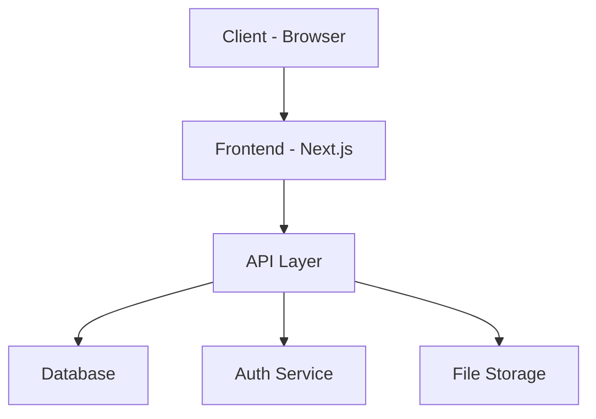

# PRD Template

Use this template structure when generating the final PRD document. Fill every section. Adapt headings to the specific product — remove sections that genuinely don't apply, but err on the side of inclusion.

---

## Template Structure

````markdown
# PRD: {New Product Name}

> A clone/replica of [{Original Product Name}]({Original URL})
> Generated on: {date}

---

## 1. Product Vision & Overview

### 1.1 Problem Statement

What problem does the original product solve? Why does it exist?

### 1.2 Product Vision

One-paragraph vision for the clone. What is the goal of building this?

### 1.3 Target Audience

Who are the primary users? List 2-4 user personas with brief descriptions.

### 1.4 Success Metrics

How will we measure if the product is successful? List 4-6 KPIs with targets.

| Metric | Target | Measurement Method |
| ------ | ------ | ------------------ |
| ...    | ...    | ...                |

---

## 2. User Stories & Personas

### 2.1 User Personas

For each persona:

- **Name & Role** — archetype description
- **Goals** — what they want to achieve
- **Pain Points** — what frustrates them today
- **Key Actions** — primary things they do in the product

### 2.2 User Stories

Group by persona. Use the format:

> As a [persona], I want to [action] so that [benefit].

Prioritize with MoSCoW labels: **Must Have**, **Should Have**, **Could Have**, **Won't Have (v1)**.

---

## 3. Features Breakdown

### 3.1 Feature Map

High-level feature categories with sub-features.

| #   | Feature | Priority    | Complexity | Description |
| --- | ------- | ----------- | ---------- | ----------- |
| F1  | ...     | Must Have   | Medium     | ...         |
| F2  | ...     | Should Have | High       | ...         |

### 3.2 Detailed Feature Specs

For each Must Have and Should Have feature, provide:

#### F{n}: {Feature Name}

- **Description**: What it does
- **User flow**: Step-by-step interaction
- **Acceptance criteria**: Bullet list of testable conditions
- **Edge cases**: Known edge cases to handle
- **Dependencies**: Other features this depends on

---

## 4. Technical Architecture

### 4.1 Tech Stack

| Layer    | Technology | Version | Rationale |
| -------- | ---------- | ------- | --------- |
| Frontend | ...        | ...     | ...       |
| Backend  | ...        | ...     | ...       |
| Database | ...        | ...     | ...       |
| Auth     | ...        | ...     | ...       |
| Hosting  | ...        | ...     | ...       |
| ...      | ...        | ...     | ...       |

### 4.2 System Architecture

Describe the high-level architecture. Include a Mermaid diagram:


````

Adapt the diagram to the actual architecture.

### 4.3 Data Model

List core entities with their key fields and relationships:

```mermaid
erDiagram
    USER ||--o{ PROJECT : owns
    PROJECT ||--o{ TASK : contains
    ...
```

### 4.4 API Design

List the main API routes/endpoints grouped by resource:

| Method | Endpoint | Description | Auth Required |
| ------ | -------- | ----------- | ------------- |
| GET    | /api/... | ...         | Yes           |
| POST   | /api/... | ...         | Yes           |

### 4.5 Third-Party Integrations

| Service | Purpose | Integration Method       |
| ------- | ------- | ------------------------ |
| ...     | ...     | SDK / REST API / Webhook |

---

## 5. UI/UX Guidelines

### 5.1 Design Principles

3-5 guiding design principles based on analysis of the original product.

### 5.2 Key Screens

List the main screens/pages with brief descriptions of purpose and layout.

### 5.3 Navigation Structure

Describe the navigation pattern (sidebar, top nav, tabs, etc.).

### 5.4 Responsive Strategy

How the product should adapt across breakpoints (mobile, tablet, desktop).

---

## 6. MVP Scope

### 6.1 MVP Feature Set

Which features are in v1.0? Draw a clear line.

### 6.2 Out of Scope (v1)

What is explicitly NOT in the MVP? List features deferred to future versions.

### 6.3 MVP Acceptance Criteria

What conditions must be met to consider the MVP complete?

---

## 7. Development Roadmap

### 7.1 Milestones

| Phase | Milestone        | Key Deliverables          | Estimated Duration |
| ----- | ---------------- | ------------------------- | ------------------ |
| 1     | Project Setup    | Repo, CI/CD, base config  | 1 week             |
| 2     | Core Backend     | Auth, DB, base API        | 2 weeks            |
| 3     | Core Frontend    | Main UI, routing, state   | 2 weeks            |
| 4     | Feature Build    | MVP features              | 3-4 weeks          |
| 5     | Testing & Polish | QA, performance, UX fixes | 1-2 weeks          |
| 6     | Launch           | Deploy, monitoring, docs  | 1 week             |

### 7.2 Dependencies & Risks

| Risk | Likelihood | Impact | Mitigation |
| ---- | ---------- | ------ | ---------- |
| ...  | Medium     | High   | ...        |

---

## 8. Non-Functional Requirements

### 8.1 Performance

- Page load time targets
- API response time targets
- Concurrent user capacity

### 8.2 Security

- Authentication & authorization approach
- Data encryption (at rest, in transit)
- Input validation & sanitization
- OWASP top 10 considerations

### 8.3 Scalability

- Horizontal/vertical scaling strategy
- Database scaling approach
- Caching strategy

### 8.4 Accessibility

- WCAG compliance target level
- Key accessibility requirements

### 8.5 Internationalization

- i18n requirements (if any)
- Supported locales

---

## 9. Analytics & Monitoring

### 9.1 Key Events to Track

List user actions and system events to instrument.

### 9.2 Monitoring & Alerting

What to monitor and when to alert.

---

## 10. Open Questions

List any unresolved decisions or items needing further research.

| #   | Question | Owner | Status |
| --- | -------- | ----- | ------ |
| 1   | ...      | ...   | Open   |

```

---

## Writing Guidelines

- Write in clear, direct language
- Use tables for structured comparisons
- Include Mermaid diagrams for architecture and data models
- Be specific — avoid vague language like "good performance" without numbers
- Every feature should have acceptance criteria
- Every tech choice should have a rationale
- Mark assumptions explicitly
- Use MoSCoW prioritization consistently
```
